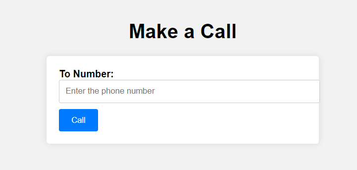
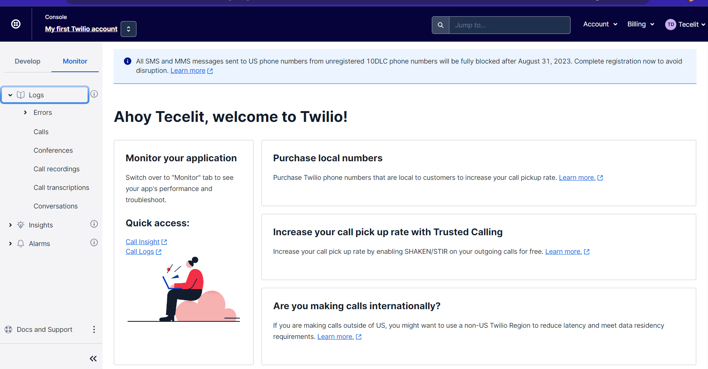
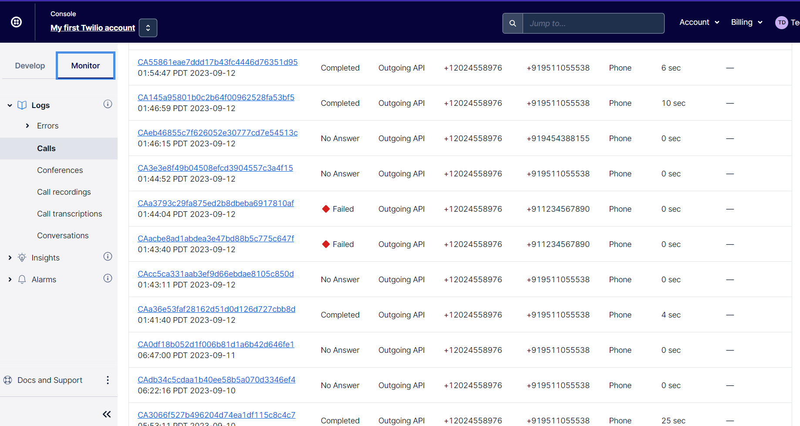
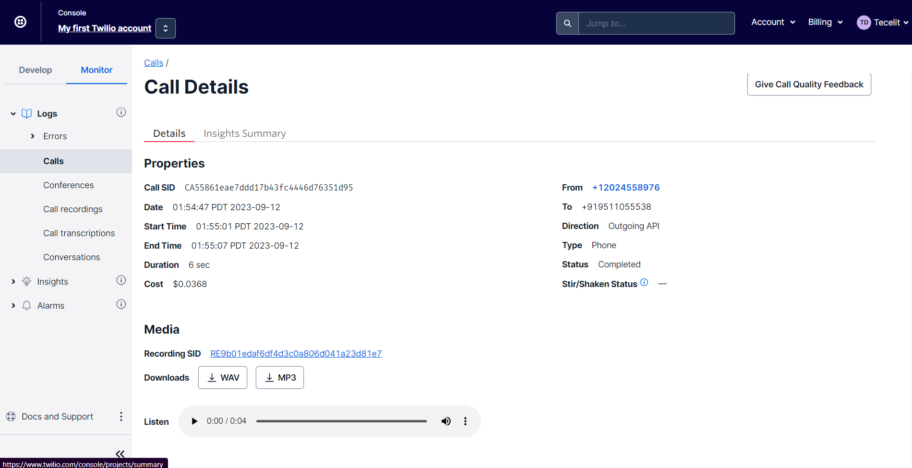
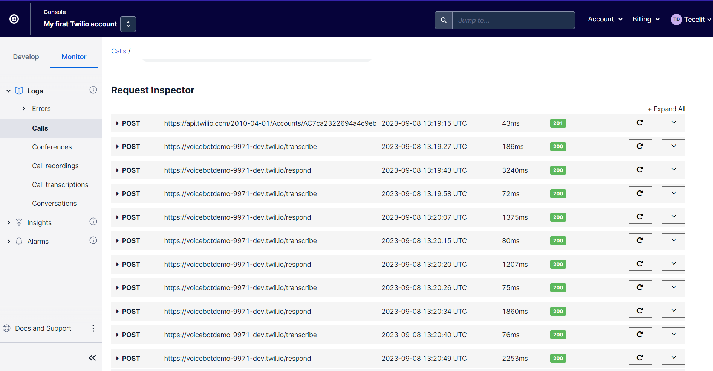

# Readme for Twilio ChatGPT Integration

## Prerequisites

Before you start integrating Twilio with ChatGPT, make sure you have the following prerequisites:

1. **Twilio Account:** Sign up for a Twilio account. 

2. **Twilio Phone Number:** Obtain a Twilio phone number. You can find instructions on how to get your first Twilio number in your trial account [here](https://www.twilio.com/docs/usage/tutorials/how-to-use-your-free-trial-account#get-your-first-twilio-phone-number).

3. **OpenAI API Key:** You'll need an OpenAI API key on a premium plan or with available credits. You can sign up for an OpenAI API key on their [website](https://beta.openai.com/signup/).

4. **Twilio CLI with Serverless Toolkit:** Make sure you have the Twilio CLI installed with the Serverless Toolkit. You can install it using the following command:

   ```
   npm install twilio-cli -g
   ```

## Integration Steps

### Setting Up the Backend

1. Create a new Serverless project using the Twilio Serverless Toolkit. Replace `<project-name>` with a name of your choice:

   ```
   twilio serverless:init <project-name>
   ```
   
2. Navigate to the directory of your project.

3. Create a `.env` file similar as `.env.example` with your Twilio authentication token as `AUTH_TOKEN` and your OpenAI API key as `OPENAI_API_KEY`. Your Twilio account SID should be auto-populated. Your `.env` file should look like this (replace `XXXXX` with your respective keys):

   ```
   ACCOUNT_SID=XXXXX
   AUTH_TOKEN=XXXXX
   OPENAI_API_KEY=XXXXX
   TWILIO_NUMBER = XXXX
   ```

4. Install the OpenAI NPM package as a dependency:

   ```
   npm install openai
   ```

### Creating Functions

5. Create two Functions mainly , `/transcribe` and `/respond` ,and `/makeacall`[it is for outgoing call ]. Create JavaScript files named `transcribe.js` and `respond.js` in the functions folder of your project.
    /transcribe function - used to generate the user speech to text in real time on the call .
    /respond function - used to generate response for the user query  using chatgpt and convert it to into speech and respond
    /makeacall function - used to make a outbound call to the user using twilio number .

   
### Choose language Of the agent
   `/english` - the responses will be in english only and the query also in english
   `/hindi` - the responses can in hindi or english or both and query also . 

### End_to end api testing 

Open the `function/end_to_end` folder and copy the transcribe.js and respond.js for the api functionality code .

Run the server of the talkativegptAssistant and on the localhost 8000 and then generate a  ngrok url by the command `ngrok http 8000` , a ngrok url will generate such that `https://ae82-2405-201-4036-8842-95ca-a370-f534-6b88.ngrok.io`,copy the url.

Open the respond.js function then paste the ngrok url calling `/api/call` e.g
`https://ae82-2405-201-4036-8842-95ca-a370-f534-6b88.ngrok.io/api/call` , then deploy the server using `twilio serverless deploy :force`.


now use the following command for updating the deployment for incoming call on that twilio number 
{// the url of transcribe function is generated after the following command `twilio serverless deploy :force` .}

` twilio phone-numbers:update <PN SID or E.164> --voice-url=<The URL for the /transcribe Function>`
    
### Transcribe Function

6. Open `transcribe.js` and add the following code:
     
   ```
   // Copy and Paste the code from the /transcribe functions form function folder
   ```

### Respond Function

7. Open `respond.js` and add the following code:

   ```
   // Copy the code from the /respond functions form function folder
   ```
   
### makeacall Function

7. Open `makeacall.js` and add the following code:

   ```
   // Add the code for the /makeacall Function here
   ```
   
### Deployment

9. Deploy your project using the following command:

   ```
   twilio serverless:deploy
   ```

### Configuring Phone Number

10. Configure a Twilio phone number to use the Functions you created by running the following command (replace `<PN SID>` or `<E.164>` with the appropriate value and `<The URL for the /transcribe Function>` with the URL for your `/makeacall` Function):

   ```
   twilio phone-numbers:list
   // then copy the phone sid of the number that you have to work in twilio
   ```
   ```
   twilio phone-numbers:update <PN SID or E.164> --voice-url=<The URL for the /makeacall Function>
   ```
  
  and Click on the link generated using above command
   

### Testing

11. Test your integration by making a call to your configured Twilio phone number.

Now your integration is ready to capture spoken input from callers, convert it to text using Twilio speech recognition, send it to the ChatGPT API, and play the response back to the caller in the form of AI-generated speech. Enjoy your Twilio ChatGPT integration!

### Check Content of the Call

12.   We can still get our hands on the content of the conversation using the Call Events API. Here's how to grab the details using the Twilio :

```
twilio api:core:calls:events:list --call-sid <The call SID you want data> -o json
// the call sid is that you get when executed makeacall.js

```


Using this API you can retrieve the requests, responses, and associated parameters and pump them directly into your internal systems to do things like provide agents a heads-up about what the caller had been asking about before they were connected

### Testing With Form to Redirect to the query paramter 
12.  In `assets\testing\form.html` , you can make a outbound call simply writing your number and the format of number should be in <E.164>

  

  and on calling you will redirect to 

  


### Debugging from Twilio Dashboard

13.  Login on Twilio console , and then Twilio Dashboard will open,then click on the monitor section so you can check all the content of the conversation done during the call using Twilio.
    

 => Click on the `Log` , so can access the various contents in distinct way. 
     
 => When click on `error` , you will get all the call details of the calls in which error occurs 
        

 => on clicking on `calls`, you will have access to all calls done using twilio
        
       

 => to access the particular call info, click on the `call sid` and you will get all the call details and also their request inspector logs 

  
  


      
    