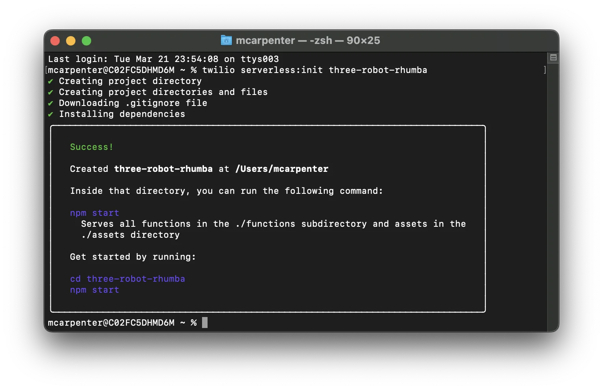

# Readme for Twilio ChatGPT Integration

## Prerequisites

Before you start integrating Twilio with ChatGPT, make sure you have the following prerequisites:

1. **Twilio Account:** Sign up for a Twilio account. 

2. **Twilio Phone Number:** Obtain a Twilio phone number. You can find instructions on how to get your first Twilio number in your trial account [here](https://www.twilio.com/docs/usage/tutorials/how-to-use-your-free-trial-account#get-your-first-twilio-phone-number).

3. **OpenAI API Key:** You'll need an OpenAI API key on a premium plan or with available credits. You can sign up for an OpenAI API key on their [website](https://beta.openai.com/signup/).

4. **Twilio CLI with Serverless Toolkit:** Make sure you have the Twilio CLI installed with the Serverless Toolkit. You can install it using the following command:

   ```
   npm install twilio-cli -g
   ```

## Integration Steps

### Setting Up the Backend

1. Create a new Serverless project using the Twilio Serverless Toolkit. Replace `<project-name>` with a name of your choice:

   ```
   twilio serverless:init <project-name>
   ```

   

2. Navigate to the directory of your project.

3. Create a `.env` file similar as `.env.example` with your Twilio authentication token as `AUTH_TOKEN` and your OpenAI API key as `OPENAI_API_KEY`. Your Twilio account SID should be auto-populated. Your `.env` file should look like this (replace `XXXXX` with your respective keys):

   ```
   ACCOUNT_SID=XXXXX
   AUTH_TOKEN=XXXXX
   OPENAI_API_KEY=XXXXX
   ```

4. Install the OpenAI NPM package as a dependency:

   ```
   npm install openai
   ```

### Creating Functions

5. Create two Functions, `/transcribe` and `/respond` and `/makeacall`. Create JavaScript files named `transcribe.js` and `respond.js` in the functions folder of your project.
    /transcribe function - used to generate the user speech to text in real time on the call .
    /respond function - used to generate response for the user query  using chatgpt and convert it to into speech and respond
    /makeacall function - used to make a outbound call to the user using twilio number .
   

### Transcribe Function

6. Open `transcribe.js` and add the following code:
     
   ```
   // Copy and Paste the code from the /transcribe functions form function folder
   ```

### Respond Function

7. Open `respond.js` and add the following code:

   ```
   // Copy the code from the /respond functions form function folder
   ```
   
### makeacall Function

7. Open `makeacall.js` and add the following code:

   ```
   // Add the code for the /makeacall Function here
   ```
   
### Deployment

9. Deploy your project using the following command:

   ```
   twilio serverless:deploy
   ```

### Configuring Phone Number

10. Configure a Twilio phone number to use the Functions you created by running the following command (replace `<PN SID>` or `<E.164>` with the appropriate value and `<The URL for the /transcribe Function>` with the URL for your `/makeacall` Function):

   ```
   twilio phone-numbers:list
   // then copy the phone sid of the number that you have to work in twilio
   ```
   ```
   twilio phone-numbers:update <PN SID or E.164> --voice-url=<The URL for the /makeacall Function>
   ```


### Testing

11. Test your integration by making a call to your configured Twilio phone number.

Now your integration is ready to capture spoken input from callers, convert it to text using Twilio speech recognition, send it to the ChatGPT API, and play the response back to the caller in the form of AI-generated speech. Enjoy your Twilio ChatGPT integration!